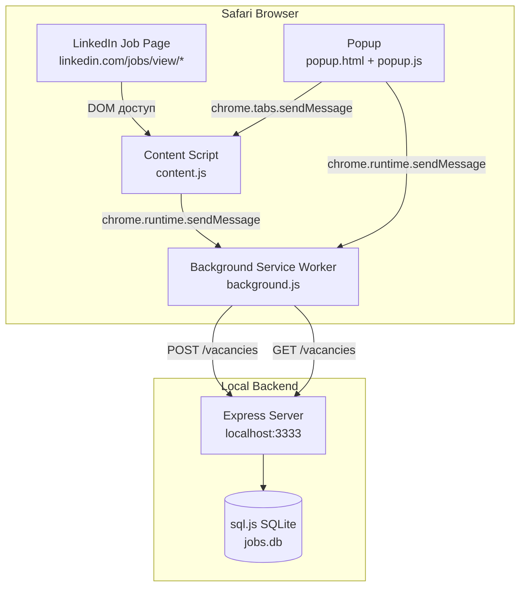
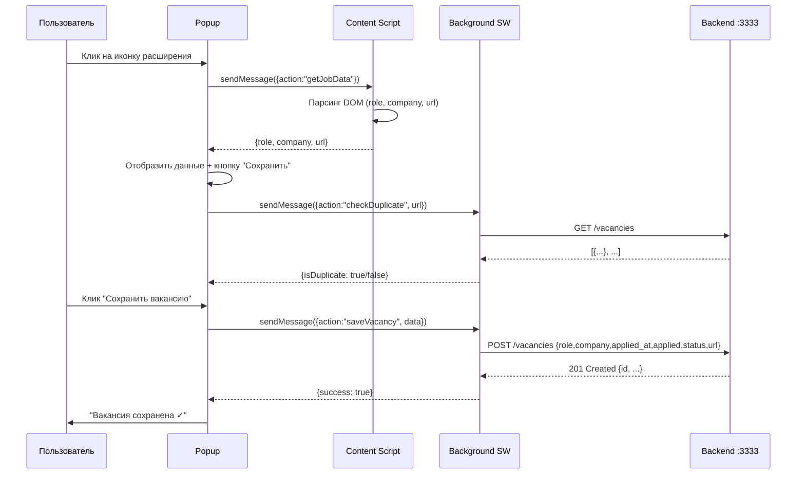
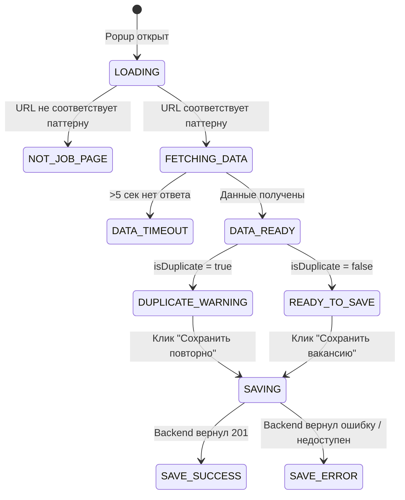

# Design Document

## Safari LinkedIn Job Parser — Safari Web Extension

---

## Overview

Safari Web Extension для macOS, которое позволяет сохранять вакансии с LinkedIn в локальную базу данных одним кликом. Расширение работает поверх уже готового бэкенда (`http://localhost:3333`) и состоит из трёх JavaScript-компонентов: Content Script, Background Service Worker и Popup.

### Ключевые принципы дизайна

- **Минимальные разрешения** — запрашиваем только `activeTab` и `host_permissions` для LinkedIn и localhost.
- **Без серверной части** — всё хранение делегировано существующему бэкенду; расширение только читает и пишет через REST API.
- **Отказоустойчивость** — каждый шаг (парсинг, сетевой запрос) имеет явный fallback и сообщение об ошибке для пользователя.
- **Manifest V3** — используем современный стандарт Safari/Chrome Web Extensions с Service Worker вместо Background Page.

---

## Architecture

### Диаграмма компонентов



### Поток данных при сохранении вакансии



### Архитектурные решения

| Решение | Обоснование |
|---|---|
| Popup → Content Script через `sendMessage` | Content Script имеет доступ к DOM; Popup — нет. Сообщения — стандартный способ коммуникации. |
| Сетевые запросы только в Background SW | CORS и `fetch` к `localhost` из Popup могут блокироваться Safari; Background SW надёжнее. |
| Проверка дубликатов при открытии Popup | Пользователь видит предупреждение до нажатия кнопки, а не после. |
| Manifest V3 + Service Worker | Современный стандарт; Background Page устарел и не поддерживается в новых версиях Safari. |

---

## Components and Interfaces

### 1. `manifest.json`

Точка входа расширения. Описывает все компоненты, разрешения и точки активации.

```json
{
  "manifest_version": 3,
  "name": "LinkedIn Job Saver",
  "version": "1.0.0",
  "description": "Сохраняет вакансии с LinkedIn в локальный трекер одним кликом",
  "permissions": ["activeTab"],
  "host_permissions": [
    "https://www.linkedin.com/*",
    "http://localhost:3333/*"
  ],
  "background": {
    "service_worker": "background.js"
  },
  "action": {
    "default_popup": "popup.html",
    "default_icon": {
      "16": "icons/icon16.png",
      "48": "icons/icon48.png",
      "128": "icons/icon128.png"
    }
  },
  "content_scripts": [
    {
      "matches": ["https://www.linkedin.com/jobs/view/*"],
      "js": ["content.js"],
      "run_at": "document_idle"
    }
  ]
}
```

**Ключевые поля:**
- `permissions: ["activeTab"]` — минимальный доступ к текущей вкладке.
- `host_permissions` — явное разрешение на запросы к LinkedIn и localhost.
- `content_scripts.matches` — Content Script инжектируется только на страницах вакансий.
- `run_at: "document_idle"` — скрипт запускается после полной загрузки DOM.

---

### 2. Content Script (`content.js`)

**Ответственность:** Парсинг DOM страницы LinkedIn и возврат данных вакансии по запросу от Popup.

**Интерфейс сообщений:**

```
Входящее сообщение:
  { action: "getJobData" }

Исходящее сообщение (ответ):
  {
    success: true,
    data: {
      role: string,    // название роли или "Не определено"
      company: string, // название компании или "Не определено"
      url: string      // window.location.href
    }
  }
  | { success: false, error: string }
```

**Логика парсинга DOM:**

LinkedIn использует несколько возможных CSS-селекторов для одних и тех же полей (A/B тесты, обновления вёрстки). Парсер перебирает список кандидатов и берёт первый найденный.

```
Селекторы для role (в порядке приоритета):
  1. h1.top-card-layout__title
  2. h1[class*="job-title"]
  3. .job-details-jobs-unified-top-card__job-title h1
  4. h1 (первый на странице)

Селекторы для company (в порядке приоритета):
  1. .top-card-layout__card a.topcard__org-name-link
  2. .job-details-jobs-unified-top-card__company-name a
  3. [class*="company-name"] a
  4. [class*="company-name"] (текстовое содержимое)
```

**Псевдокод парсера:**

```
function parseJobData():
  role = trySelectors(ROLE_SELECTORS).trim() || "Не определено"
  company = trySelectors(COMPANY_SELECTORS).trim() || "Не определено"
  url = window.location.href
  return { role, company, url }

function trySelectors(selectors):
  for selector in selectors:
    el = document.querySelector(selector)
    if el and el.textContent.trim() != "":
      return el.textContent.trim()
  return ""
```

**Слушатель сообщений:**

```
chrome.runtime.onMessage.addListener((message, sender, sendResponse):
  if message.action == "getJobData":
    try:
      data = parseJobData()
      sendResponse({ success: true, data })
    catch error:
      sendResponse({ success: false, error: error.message })
    return true  // асинхронный ответ
```

---

### 3. Background Service Worker (`background.js`)

**Ответственность:** Выполнение сетевых запросов к бэкенду (проверка дубликатов, сохранение вакансии). Является единственным компонентом, который общается с `localhost:3333`.

**Интерфейс сообщений:**

```
Входящее: { action: "checkDuplicate", url: string }
Исходящее: { isDuplicate: boolean } | { error: string }

Входящее: { action: "saveVacancy", data: VacancyPayload }
Исходящее: { success: true, vacancy: Vacancy } | { success: false, error: string, status?: number }
```

**Тип `VacancyPayload`:**

```
{
  role: string,
  company: string,
  applied_at: string,  // "YYYY-MM-DD"
  applied: false,
  status: "saved",
  url: string
}
```

**Логика `checkDuplicate`:**

```
async function checkDuplicate(url):
  response = await fetch("http://localhost:3333/vacancies", { signal: AbortSignal.timeout(5000) })
  if not response.ok:
    throw new Error("Backend error: " + response.status)
  vacancies = await response.json()
  return vacancies.some(v => v.url === url)
```

**Логика `saveVacancy`:**

```
async function saveVacancy(data):
  response = await fetch("http://localhost:3333/vacancies", {
    method: "POST",
    headers: { "Content-Type": "application/json" },
    body: JSON.stringify(data),
    signal: AbortSignal.timeout(5000)
  })
  if response.status == 201:
    vacancy = await response.json()
    return { success: true, vacancy }
  else:
    body = await response.json()
    return { success: false, error: body.error || "Неизвестная ошибка", status: response.status }
```

**Обработка сетевых ошибок:**

```
catch (error):
  if error.name == "TimeoutError":
    return { success: false, error: "Бэкенд недоступен. Убедитесь, что сервер запущен на http://localhost:3333" }
  if error.name == "TypeError":  // fetch failed (сервер не запущен)
    return { success: false, error: "Бэкенд недоступен. Убедитесь, что сервер запущен на http://localhost:3333" }
  return { success: false, error: error.message }
```

---

### 4. Popup (`popup.html` + `popup.js`)

**Ответственность:** UI расширения. Управляет состоянием отображения, запрашивает данные у Content Script и Background SW, отображает результат пользователю.

#### 4.1 Состояния Popup (State Machine)



#### 4.2 HTML-структура (`popup.html`)

```html
<!DOCTYPE html>
<html lang="ru">
<head>
  <meta charset="UTF-8">
  <title>LinkedIn Job Saver</title>
  <link rel="stylesheet" href="popup.css">
</head>
<body>
  <!-- Состояние: загрузка -->
  <div id="state-loading" class="state">
    <div class="spinner"></div>
    <p>Загрузка данных...</p>
  </div>

  <!-- Состояние: не страница вакансии -->
  <div id="state-not-job-page" class="state hidden">
    <p class="info">Откройте страницу вакансии на LinkedIn</p>
  </div>

  <!-- Состояние: ошибка получения данных -->
  <div id="state-data-error" class="state hidden">
    <p class="error" id="data-error-message"></p>
  </div>

  <!-- Состояние: данные готовы -->
  <div id="state-data-ready" class="state hidden">
    <div class="field">
      <label>Роль</label>
      <span id="field-role"></span>
    </div>
    <div class="field">
      <label>Компания</label>
      <span id="field-company"></span>
    </div>
    <div class="field">
      <label>URL</label>
      <span id="field-url" class="url-truncated"></span>
    </div>

    <!-- Предупреждение о дубликате -->
    <div id="duplicate-warning" class="warning hidden">
      ⚠️ Эта вакансия уже сохранена
    </div>

    <!-- Кнопки -->
    <button id="btn-save" class="btn-primary">Сохранить вакансию</button>
    <button id="btn-save-anyway" class="btn-secondary hidden">Сохранить повторно</button>

    <!-- Результат сохранения -->
    <p id="save-result" class="hidden"></p>
  </div>

  <script src="popup.js"></script>
</body>
</html>
```

#### 4.3 Логика Popup (`popup.js`)

```
CONSTANTS:
  JOB_PAGE_PATTERN = /^https:\/\/www\.linkedin\.com\/jobs\/view\//
  DATA_TIMEOUT_MS = 5000

ON DOMContentLoaded:
  showState("loading")
  tab = await getCurrentTab()

  if not JOB_PAGE_PATTERN.test(tab.url):
    showState("not-job-page")
    return

  // Запрос данных у Content Script с таймаутом
  jobData = await withTimeout(
    sendMessageToTab(tab.id, { action: "getJobData" }),
    DATA_TIMEOUT_MS
  )

  if jobData.success == false:
    showError(jobData.error || "Не удалось получить данные страницы")
    return

  // Отобразить данные
  fillFields(jobData.data)

  // Проверить дубликат
  dupResult = await sendMessageToBackground({ action: "checkDuplicate", url: jobData.data.url })
  if dupResult.isDuplicate:
    showDuplicateWarning()

  showState("data-ready")

ON btn-save click:
  saveJob(jobData.data, forceSave=false)

ON btn-save-anyway click:
  saveJob(jobData.data, forceSave=true)

async function saveJob(data, forceSave):
  disableSaveButtons()
  payload = {
    role: data.role,
    company: data.company,
    applied_at: formatDate(new Date()),  // "YYYY-MM-DD"
    applied: false,
    status: "saved",
    url: data.url
  }
  result = await sendMessageToBackground({ action: "saveVacancy", data: payload })
  if result.success:
    showSaveResult("success", "Вакансия сохранена ✓")
  else:
    showSaveResult("error", result.error)
    enableSaveButtons()

function formatDate(date):
  return date.toISOString().split("T")[0]  // "YYYY-MM-DD"
```

---

## Data Models

### Vacancy (модель данных вакансии)

Соответствует схеме таблицы `vacancies` в бэкенде.

```typescript
interface Vacancy {
  id: number;           // автоинкремент, присваивается бэкендом
  role: string;         // название роли, обязательное
  company: string;      // название компании, обязательное
  applied_at: string;   // дата в формате "YYYY-MM-DD", обязательная
  applied: boolean;     // подана ли заявка, по умолчанию false
  status: string;       // статус: "saved" | "applied" | "rejected" | ..., по умолчанию "saved"
  url: string;          // URL страницы вакансии
  notes: string;        // заметки (не используются расширением, но поддерживаются бэкендом)
  created_at: string;   // дата создания, проставляется бэкендом автоматически
}
```

### VacancyPayload (тело POST-запроса от расширения)

```typescript
interface VacancyPayload {
  role: string;         // из парсера или "Не определено"
  company: string;      // из парсера или "Не определено"
  applied_at: string;   // текущая дата "YYYY-MM-DD"
  applied: false;       // всегда false при первом сохранении
  status: "saved";      // всегда "saved" при первом сохранении
  url: string;          // window.location.href
}
```

### ParsedJobData (внутренняя модель парсера)

```typescript
interface ParsedJobData {
  role: string;     // текст из DOM или "Не определено"
  company: string;  // текст из DOM или "Не определено"
  url: string;      // window.location.href
}
```

### Message Protocol (протокол сообщений между компонентами)

```typescript
// Popup → Content Script
type GetJobDataRequest = { action: "getJobData" }
type GetJobDataResponse =
  | { success: true; data: ParsedJobData }
  | { success: false; error: string }

// Popup → Background SW
type CheckDuplicateRequest = { action: "checkDuplicate"; url: string }
type CheckDuplicateResponse =
  | { isDuplicate: boolean }
  | { error: string }

type SaveVacancyRequest = { action: "saveVacancy"; data: VacancyPayload }
type SaveVacancyResponse =
  | { success: true; vacancy: Vacancy }
  | { success: false; error: string; status?: number }
```

### Структура файлов расширения

```
safari-linkedin-job-parser/
├── manifest.json          # Манифест MV3
├── background.js          # Service Worker: сетевые запросы
├── content.js             # Content Script: парсинг DOM
├── popup.html             # UI расширения
├── popup.js               # Логика UI
├── popup.css              # Стили
└── icons/
    ├── icon16.png
    ├── icon48.png
    └── icon128.png
```

---

## Correctness Properties

*A property is a characteristic or behavior that should hold true across all valid executions of a system — essentially, a formal statement about what the system should do. Properties serve as the bridge between human-readable specifications and machine-verifiable correctness guarantees.*

---

### Property 1: URL-паттерн корректно классифицирует страницы

*For any* строки URL, функция `isJobPage(url)` должна возвращать `true` тогда и только тогда, когда URL соответствует паттерну `https://www.linkedin.com/jobs/view/` — и `false` для всех остальных URL, включая другие страницы LinkedIn, произвольные строки и пустые значения.

**Validates: Requirements 1.2**

---

### Property 2: Парсер всегда возвращает непустую строку для role

*For any* HTML-фрагмент, функция `parseJobData()` должна возвращать объект, где поле `role` является непустой строкой: либо текст, извлечённый из первого найденного селектора, либо строка `"Не определено"` — никогда `null`, `undefined` или пустая строка.

**Validates: Requirements 2.1, 2.4**

---

### Property 3: Парсер всегда возвращает непустую строку для company

*For any* HTML-фрагмент, функция `parseJobData()` должна возвращать объект, где поле `company` является непустой строкой: либо текст, извлечённый из первого найденного селектора, либо строка `"Не определено"` — никогда `null`, `undefined` или пустая строка.

**Validates: Requirements 2.2, 2.5**

---

### Property 4: Парсер не изменяет DOM страницы

*For any* HTML-фрагмент, сериализация DOM (через `document.body.innerHTML`) до вызова `parseJobData()` должна быть идентична сериализации после вызова. Парсер является чисто читающей операцией.

**Validates: Requirements 2.6**

---

### Property 5: fillFields корректно отображает данные вакансии

*For any* объект `ParsedJobData` с произвольными строками `role`, `company`, `url`, после вызова `fillFields(data)` текстовое содержимое элементов `#field-role`, `#field-company`, `#field-url` должно точно совпадать с соответствующими полями объекта.

**Validates: Requirements 3.1**

---

### Property 6: Тело POST-запроса содержит все обязательные поля с корректными типами

*For any* объект `ParsedJobData`, функция `buildPayload(data)` должна возвращать объект `VacancyPayload`, где: `role` и `company` — непустые строки, `applied_at` соответствует формату `YYYY-MM-DD`, `applied === false`, `status === "saved"`, `url` — строка.

**Validates: Requirements 4.2**

---

### Property 7: Обнаружение дубликата по URL

*For any* массив объектов `Vacancy[]` и строка `url`, функция `isDuplicateUrl(vacancies, url)` должна возвращать `true` тогда и только тогда, когда хотя бы один элемент массива имеет поле `url`, строго равное переданному значению.

**Validates: Requirements 5.2**

---

### Property 8: Ошибка сохранения отображается при любом не-201 статусе

*For any* HTTP-статус ответа бэкенда, отличный от `201`, обработчик ответа в Background SW должен возвращать объект `{ success: false, error: string }`, где `error` является непустой строкой.

**Validates: Requirements 4.5**

---

## Error Handling

### Матрица ошибок и реакций системы

| Ситуация | Компонент | Реакция | Сообщение пользователю |
|---|---|---|---|
| URL не соответствует паттерну | Popup | Показать состояние `not-job-page` | «Откройте страницу вакансии на LinkedIn» |
| Content Script не ответил за 5 сек | Popup | Показать состояние `data-error` | «Не удалось получить данные страницы» |
| Content Script выбросил исключение | Popup | Показать состояние `data-error` | Текст ошибки из `error.message` |
| Парсер не нашёл роль в DOM | Content Script | Вернуть `"Не определено"` | Отображается в поле «Роль» |
| Парсер не нашёл компанию в DOM | Content Script | Вернуть `"Не определено"` | Отображается в поле «Компания» |
| Backend вернул 400 (невалидные данные) | Background SW | `{ success: false, error }` | «Ошибка сохранения: [текст от сервера]» |
| Backend вернул 500 | Background SW | `{ success: false, error }` | «Ошибка сохранения: [текст от сервера]» |
| Backend недоступен (TypeError) | Background SW | `{ success: false, error }` | «Бэкенд недоступен. Убедитесь, что сервер запущен на http://localhost:3333» |
| Таймаут запроса к Backend (5 сек) | Background SW | `{ success: false, error }` | «Бэкенд недоступен. Убедитесь, что сервер запущен на http://localhost:3333» |
| Ошибка при проверке дубликата | Background SW | `{ isDuplicate: false }` (fail-open) | Предупреждение не показывается; сохранение доступно |

### Принципы обработки ошибок

1. **Fail-open для проверки дубликатов** — если GET /vacancies недоступен, не блокируем сохранение. Лучше создать дубликат, чем потерять вакансию.
2. **Явные сообщения** — каждое сообщение об ошибке содержит конкретное действие для пользователя.
3. **Таймауты везде** — все сетевые запросы и межкомпонентные сообщения имеют явный таймаут 5 секунд через `AbortSignal.timeout()`.
4. **Кнопка не разблокируется при успехе** — после успешного сохранения кнопка остаётся заблокированной, чтобы предотвратить случайное повторное нажатие.

---

## Testing Strategy

### Обзор

Расширение тестируется на двух уровнях:
- **Unit-тесты** — изолированное тестирование каждого компонента с моками.
- **Property-based тесты** — проверка универсальных свойств на случайных входных данных.

Интеграционные тесты (реальный Safari + реальный бэкенд) выходят за рамки автоматизации и выполняются вручную.

### Инструменты

| Инструмент | Назначение |
|---|---|
| **Vitest** | Test runner (поддерживает jsdom, ESM, быстрый) |
| **jsdom** | Эмуляция DOM для тестирования парсера и Popup |
| **fast-check** | Property-based testing для JavaScript |
| **vi.fn() / vi.spyOn()** | Моки для `fetch`, `chrome.*` API |

### Структура тестов

```
tests/
├── unit/
│   ├── content.test.js       # Тесты парсера
│   ├── background.test.js    # Тесты сетевых запросов
│   └── popup.test.js         # Тесты UI-логики
└── property/
    ├── url-classifier.property.test.js
    ├── parser.property.test.js
    ├── payload-builder.property.test.js
    └── duplicate-detector.property.test.js
```

### Property-Based тесты (минимум 100 итераций каждый)

#### PBT-1: URL-классификатор
```javascript
// Feature: safari-linkedin-job-parser, Property 1: URL-паттерн корректно классифицирует страницы
fc.assert(fc.property(
  fc.oneof(
    fc.webUrl(),                                          // произвольные URL
    fc.constant("https://www.linkedin.com/jobs/view/123456789/")  // валидный
  ),
  (url) => {
    const result = isJobPage(url);
    const expected = /^https:\/\/www\.linkedin\.com\/jobs\/view\//.test(url);
    return result === expected;
  }
), { numRuns: 100 });
```

#### PBT-2 & PBT-3: Парсер всегда возвращает непустую строку
```javascript
// Feature: safari-linkedin-job-parser, Property 2: Парсер всегда возвращает непустую строку для role
// Feature: safari-linkedin-job-parser, Property 3: Парсер всегда возвращает непустую строку для company
fc.assert(fc.property(
  fc.string(),  // произвольный HTML
  (html) => {
    document.body.innerHTML = html;
    const result = parseJobData();
    return (
      typeof result.role === "string" && result.role.length > 0 &&
      typeof result.company === "string" && result.company.length > 0
    );
  }
), { numRuns: 100 });
```

#### PBT-4: Парсер не изменяет DOM
```javascript
// Feature: safari-linkedin-job-parser, Property 4: Парсер не изменяет DOM страницы
fc.assert(fc.property(
  fc.string(),
  (html) => {
    document.body.innerHTML = html;
    const before = document.body.innerHTML;
    parseJobData();
    const after = document.body.innerHTML;
    return before === after;
  }
), { numRuns: 100 });
```

#### PBT-5: fillFields корректно отображает данные
```javascript
// Feature: safari-linkedin-job-parser, Property 5: fillFields корректно отображает данные вакансии
fc.assert(fc.property(
  fc.record({
    role: fc.string({ minLength: 1 }),
    company: fc.string({ minLength: 1 }),
    url: fc.webUrl()
  }),
  (data) => {
    setupPopupDOM();
    fillFields(data);
    return (
      document.getElementById("field-role").textContent === data.role &&
      document.getElementById("field-company").textContent === data.company &&
      document.getElementById("field-url").textContent === data.url
    );
  }
), { numRuns: 100 });
```

#### PBT-6: Тело запроса содержит все обязательные поля
```javascript
// Feature: safari-linkedin-job-parser, Property 6: Тело POST-запроса содержит все обязательные поля
fc.assert(fc.property(
  fc.record({
    role: fc.string({ minLength: 1 }),
    company: fc.string({ minLength: 1 }),
    url: fc.webUrl()
  }),
  (data) => {
    const payload = buildPayload(data);
    return (
      typeof payload.role === "string" && payload.role.length > 0 &&
      typeof payload.company === "string" && payload.company.length > 0 &&
      /^\d{4}-\d{2}-\d{2}$/.test(payload.applied_at) &&
      payload.applied === false &&
      payload.status === "saved" &&
      typeof payload.url === "string"
    );
  }
), { numRuns: 100 });
```

#### PBT-7: Обнаружение дубликата по URL
```javascript
// Feature: safari-linkedin-job-parser, Property 7: Обнаружение дубликата по URL
fc.assert(fc.property(
  fc.array(fc.record({ url: fc.webUrl(), role: fc.string(), company: fc.string() })),
  fc.webUrl(),
  (vacancies, url) => {
    const result = isDuplicateUrl(vacancies, url);
    const expected = vacancies.some(v => v.url === url);
    return result === expected;
  }
), { numRuns: 100 });
```

#### PBT-8: Ошибка при любом не-201 статусе
```javascript
// Feature: safari-linkedin-job-parser, Property 8: Ошибка сохранения отображается при любом не-201 статусе
fc.assert(fc.property(
  fc.integer({ min: 100, max: 599 }).filter(s => s !== 201),
  async (status) => {
    vi.stubGlobal("fetch", vi.fn().mockResolvedValue({
      status,
      ok: status >= 200 && status < 300,
      json: async () => ({ error: "test error" })
    }));
    const result = await saveVacancy(mockPayload);
    return result.success === false && typeof result.error === "string" && result.error.length > 0;
  }
), { numRuns: 100 });
```

### Unit-тесты (примеры)

| Тест | Компонент | Что проверяет |
|---|---|---|
| Парсер извлекает роль из `h1.top-card-layout__title` | content.js | Основной селектор роли |
| Парсер извлекает компанию из `.topcard__org-name-link` | content.js | Основной селектор компании |
| Popup показывает спиннер при инициализации | popup.js | Начальное состояние |
| Popup показывает кнопку «Сохранить» при успешных данных | popup.js | Состояние DATA_READY |
| Popup показывает предупреждение при isDuplicate=true | popup.js | Состояние DUPLICATE_WARNING |
| fetch вызывается с POST и Content-Type: application/json | background.js | Корректность запроса |
| Сетевая ошибка возвращает сообщение о недоступности бэкенда | background.js | Обработка TypeError |
| Таймаут возвращает сообщение о недоступности бэкенда | background.js | Обработка TimeoutError |
| manifest.json содержит все обязательные поля | manifest.json | Структура расширения |

### Ручное тестирование (Smoke Tests)

1. Загрузить расширение в Safari через Xcode в режиме разработки.
2. Открыть `https://www.linkedin.com/jobs/view/` — иконка активна, Popup показывает данные.
3. Открыть любую другую страницу — Popup показывает «Откройте страницу вакансии на LinkedIn».
4. Нажать «Сохранить вакансию» — бэкенд запущен, вакансия сохраняется, показывается «Вакансия сохранена ✓».
5. Нажать «Сохранить вакансию» повторно на той же странице — показывается предупреждение о дубликате.
6. Остановить бэкенд, нажать «Сохранить» — показывается «Бэкенд недоступен...».
